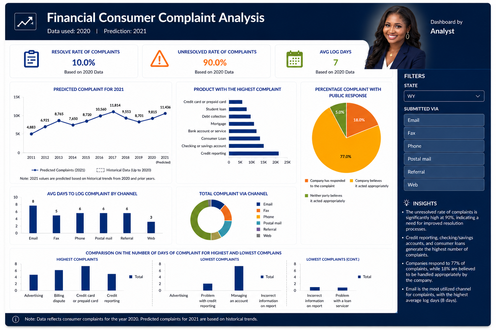

# Financial Consumer Complaint Analysis

An end-to-end data analysis project examining U.S. financial consumer complaints from 2020, with predictive insights for 2021. The dashboard highlights complaint trends, resolution rates, product categories, and channel performance to support data-driven decision making.

## Project Overview
This project analyzes consumer complaints submitted to financial institutions using historical data from 2020. The goal is to identify patterns in complaint types, resolution outcomes, and response channels, then forecast complaint volumes for 2021.

## Key Findings
- **Resolution Rate**: 10.0% of complaints were resolved in 2020
- **Unresolved Rate**: 90.0% remained unresolved
- **Average Log Days**: 7 days average time to log a complaint
- **Top Complaint Category**: Credit reporting generated the highest volume of complaints
- **Submission Channel**: Email was the most used channel, with Web having the fastest average response time
- **Public Response**: 77% of complaints received a public response deemed appropriate
- **2021 Prediction**: Complaint volume is forecasted to increase based on historical trends from 2011-2020

## Dataset
- **Source**: Financial consumer complaint records for 2020
- **Note**: Raw data is not included in this repository due to size and privacy considerations

## Tools & Technologies
- Excel for data cleaning and analysis
- Power BI / Excel Dashboard for visualization

## Repository Structure
